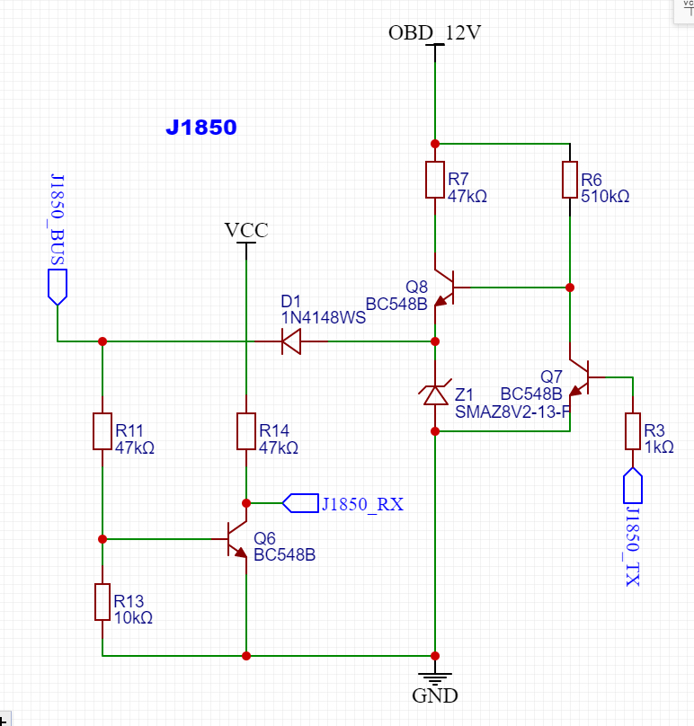

# J1850VPW ESP32 Interface GM Class 2 Serial
Credit goes to matafonoff for doing all the hard work, I just fixed the interrupts to run on ESP32.
ESP32 library which allows you to communicate via J1850VPW.
You just have to choose tx and rx pins.
It doesn't have either a header nor a parity check, just CRC check. 
All validations could be implemented at a higher protocol layer.

This library has been tested with wire connection between two ESP32 and J1850VPW bus of Corvette C6. 

## Connection
Use following schematics to connect your ESP32 to the J1850VPW bus of your vehicle:

Connections:
* J1850_RX -> pin of ESP32 that is configured as RX pin for J1850VPW
* J1850_TX -> pin of ESP32 that is configured as TX pin for J1850VPW
* J1850_BUS -> J1850VPW bus (ex. vehicle)

## Code example
~~~~

#include "j1850vpw.h"

#define TX 26
#define RX 25

void handleError(J1850_Operations op, J1850_ERRORS err);

J1850VPW vpw;

void setup()
{
    Serial.begin(115200);           // start serial port
    vpw.onError(handleError); // listen for errors
    vpw.init(RX, TX);         // init transceiver
}

void loop()
{
    static uint8_t buff[BS];                   // buffer for read message
    static uint8_t sendBuff[2] = {0x01, 0x02}; // message to send, CRC will be read and appended to frame on the fly

    uint8_t dataSize; // size of message

    // read all messages with valid CRC from cache
    while (dataSize = vpw.tryGetReceivedFrame(buff))
    {
        String s;

        // convert to hex string
        uint8_t *pData = buff;
        for (int i = 0; i < dataSize; i++)
        {
            if (i > 0)
            {
                s += " ";
            }

            if (buff[i] < 0x10)
            {
                s += '0';
            }

            s += String(pData[i], HEX);
        }

        Serial.println(s);
    }

    // write simple message to bus
    vpw.send(sendBuff, sizeof(sendBuff));

    delay(1000);
}

void handleError(J1850_Operations op, J1850_ERRORS err)
{
    if (err == J1850_OK)
    {
        // skip non errors if any
        return;
    }

    String s = op == J1850_Read ? "READ " : "WRITE ";
    switch (err)
    {
    case J1850_ERR_BUS_IS_BUSY:
        Serial.println(s + "J1850_ERR_BUS_IS_BUSY");
        break;
    case J1850_ERR_BUS_ERROR:
        Serial.println(s + "J1850_ERR_BUS_ERROR");
        break;
    case J1850_ERR_RECV_NOT_CONFIGURATED:
        Serial.println(s + "J1850_ERR_RECV_NOT_CONFIGURATED");
        break;
    case J1850_ERR_PULSE_TOO_SHORT:
        Serial.println(s + "J1850_ERR_PULSE_TOO_SHORT");
        break;
    case J1850_ERR_PULSE_OUTSIDE_FRAME:
        Serial.println(s + "J1850_ERR_PULSE_OUTSIDE_FRAME");
        break;
    case J1850_ERR_ARBITRATION_LOST:
        Serial.println(s + "J1850_ERR_ARBITRATION_LOST");
        break;
    case J1850_ERR_PULSE_TOO_LONG:
        Serial.println(s + "J1850_ERR_PULSE_TOO_LONG");
        break;
    case J1850_ERR_IFR_RX_NOT_SUPPORTED:
        Serial.println(s + "J1850_ERR_IFR_RX_NOT_SUPPORTED");
        break;
    default:
        // unknown error
        Serial.println(s + "ERR: " + String(err, HEX));
        break;
    }
}
~~~~

## NB!
This software was developed to be used with GM vehicles in a mind, and was tested on a Corvette C6. 
This means that the current protocol implementation misses some features like (IFR).
Matafonoff had tested this on the Chrysler Pacifica.

## P.S.
This library was originally written by matafonoff for AVR Arduinos and modifed to run on ESP32 by VoodooMods
